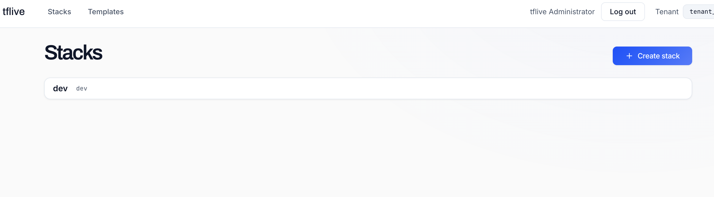
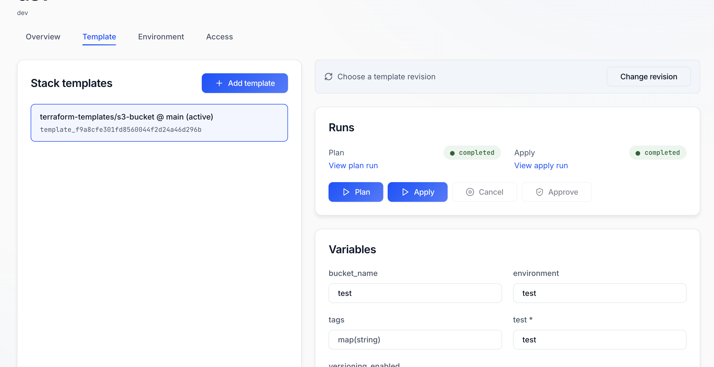
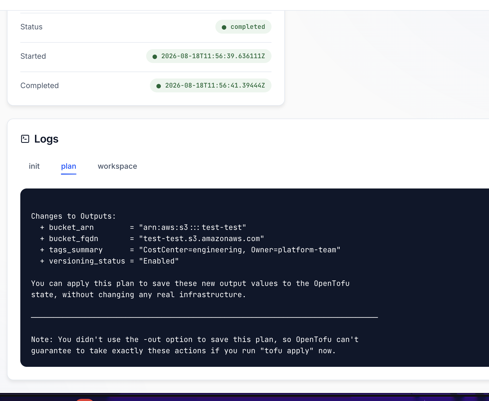
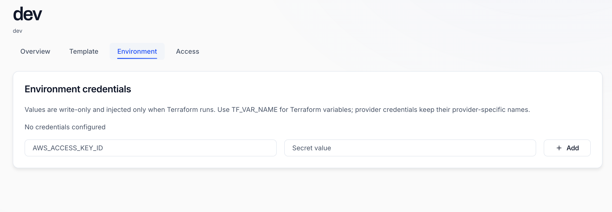
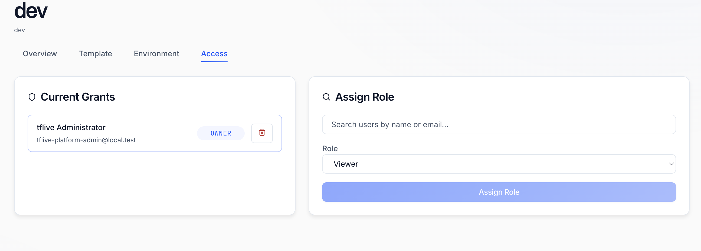
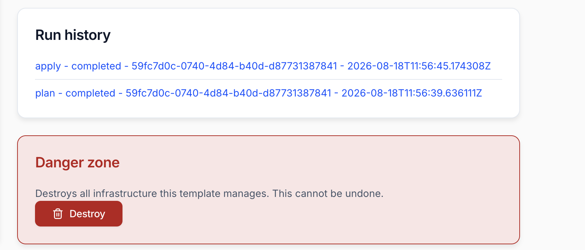

# TFlive Terraform Platform

> [!WARNING]
> tflive is not production ready. It is an MVP baseline intended for local
> development, evaluation, and continued hardening.

## What it is

tflive turns Terraform and OpenTofu modules into infrastructure you can hand to
a team. Register a module once, and anyone with access can stand up their own
copy of it from a web UI — with their own variables, their own credentials, and
a full history of every change.

## Demo

[](https://youtu.be/2oFE764dnIs)

## Screenshots

**Stacks.** Everything a team has running, in one list.



**Templates and runs.** The templates a stack is built from, the plan and apply
controls, and the input variables for this stack — on one screen.



**Runs and logs.** Every run keeps its status, its timings, and the full
`init`, `plan` and `workspace` output.



**Credentials.** Cloud credentials are write-only and injected only while
Terraform runs.



**Access.** Grant people a role on the stacks they need, not on everything.



**History, and a way out.** Past runs stay linked, and destroying is an
explicit, guarded action.



## What you can do

- **Register templates.** Point tflive at a Git repository and a revision. That
  becomes a reusable template anyone on the platform can install.
- **Compose stacks.** A stack groups the templates that make up one environment
  or one service, each with its own configuration.
- **Configure per stack.** Set input variables and attach cloud credentials
  without editing anyone's Terraform.
- **Plan, apply and destroy from the browser.** Runs are durably orchestrated,
  so a plan or apply survives a restart rather than being lost halfway.
- **Watch runs and read logs.** Every run keeps its output and its history.
- **Upgrade deliberately.** When a template gets a new revision, upgrade a stack
  to it as an explicit, reviewable step instead of drifting silently.
- **Control access per stack.** Grant people access to the stacks they need,
  rather than to everything.
- **Sign in with SSO.** Authentication is standard OIDC, and the local stack
  ships an identity provider so there is nothing to wire up to try it.

tflive requires no session or timeout configuration on your identity provider:
signed-in sessions are tflive's own record, bounded by its own absolute and
idle timeouts, independent of whatever token lifespan or SSO idle timeout the
provider runs. To get immediate revocation when a user signs out or is
disabled at the IdP, instead of waiting for those bounds, point the provider's
back-channel logout at the API's `/v1/auth/backchannel-logout` endpoint and
enable session-required logout so it includes `sid`. Without that, sessions
still end at their own bounds — nothing breaks.

That URL must be **reachable from the identity provider**, not from the
browser — a back-channel logout is a server-to-server POST, not a redirect
the browser follows. The two addresses differ whenever the IdP runs on an
internal network or behind split-horizon DNS, which is why it is a separate
setting, `TFLIVE_BACKCHANNEL_LOGOUT_URL`, rather than always derived from
`TFLIVE_PUBLIC_URL`: on this local stack, Keycloak resolves
`http://localhost:5173` (`TFLIVE_PUBLIC_URL`) inside its own container, not
the host's browser-facing port, so the provisioner registers
`http://api:8081/v1/auth/backchannel-logout` instead.

## Running it locally

Requires Docker. No Go or Node toolchain.

> [!NOTE]
> **Upgrading an existing local stack?** Run
> `docker compose -f docker-compose.yaml -f docker-compose.app.yaml down -v`
> before starting it back up. The provisioner no longer creates the
> `tflive-web` public client or its audience mapper, but an existing Keycloak
> volume keeps them from before — and the stale public client can still mint
> browser-held access tokens, which is the posture this change exists to end.

**1. Start the infrastructure and provision it.**

```bash
cp .env.example .env
docker compose up -d --wait
```

**2. Copy the two OpenFGA identifiers into `.env`.**

```bash
docker compose logs openfga-provision
```

It prints exactly two assignments. Copy both into `.env` as text — do not
execute the output:

```text
OPENFGA_STORE_ID=<store ID>
OPENFGA_MODEL_ID=<authorization model ID>
```

The application will not start without them. That is deliberate: the
authorization store it runs against should be something you chose, not
something a script picked.

**3. Start the application.**

```bash
docker compose -f docker-compose.yaml -f docker-compose.app.yaml up -d
```

First run builds from source, so it takes a few minutes. Later runs are cached.

**4. Open http://localhost:5173** and sign in with the platform administrator
credentials from `.env.example`.

> [!IMPORTANT]
> Use `localhost`, not `127.0.0.1`. The redirect URI is derived from a single
> `TFLIVE_PUBLIC_URL`, so only that exact origin is registered with Keycloak —
> `127.0.0.1` fails sign-in with "Invalid parameter: redirect_uri".

### Stopping it

Name both files, or the application keeps running:

```bash
docker compose -f docker-compose.yaml -f docker-compose.app.yaml down
```

### Starting over

To wipe everything and begin from a clean slate:

```bash
docker compose -f docker-compose.yaml -f docker-compose.app.yaml down -v
docker compose up -d --wait
```

Then repeat from step 2 — a new store means new identifiers.

### Optional extras

```bash
docker compose --profile s3 up -d      # MinIO, for S3-backed artifacts
docker compose --profile debug up -d   # Temporal UI on http://localhost:8080
```

## Documentation

- [Local development](docs/development.md) — running tflive from source
- [Architecture and product model](docs/architecture.md)
- [Authentication and authorization](docs/authentication.md)
