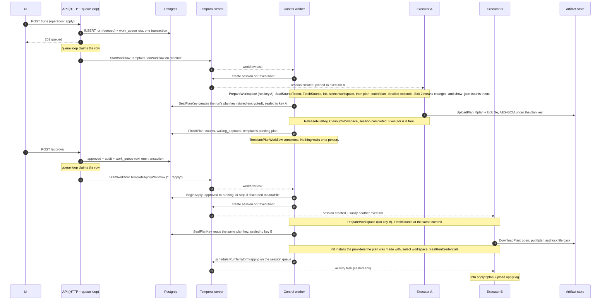
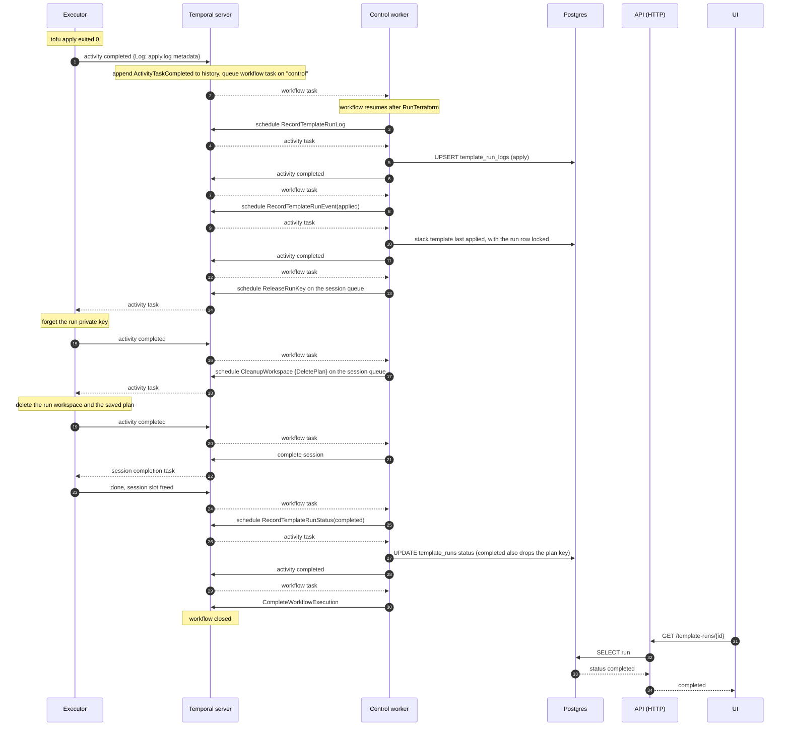
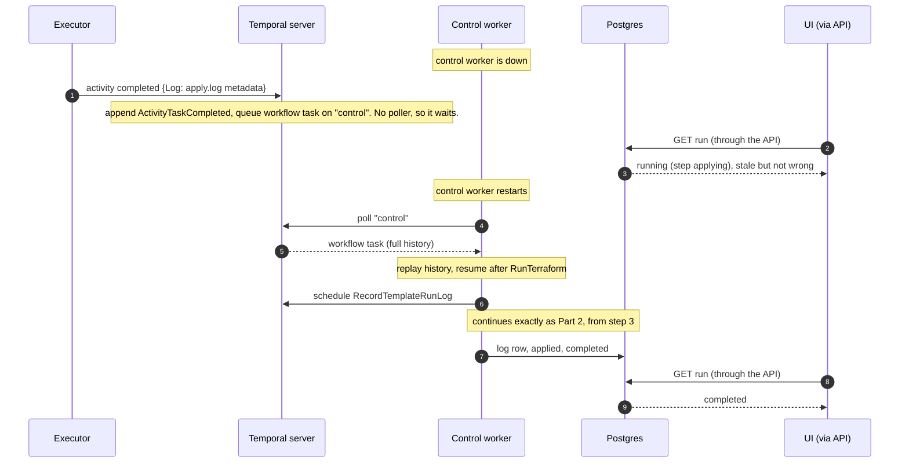

# Apply run sequence

How an apply run moves between the API, the control worker, Temporal, the
executors and Postgres, from the Apply click until the run reads `completed`.
An apply run plans first and saves the plan; approving it applies exactly that
saved plan, in a second workflow that usually lands on a different executor.
A destroy run goes the same way with a plan to destroy. A plan run stops after
the plan, and an auto-approved apply run skips it (both below). The design is in
[the saved-plan flow spec](superpowers/specs/2026-09-21-saved-plan-flow-design.md).
Background on why the processes are split this way is in
[the control plane split spec](superpowers/specs/2026-09-15-control-plane-split.md).

## Who connects to whom

Every arrow points from the process that opens the connection. Temporal never
opens a connection to anything.

The executor has no arrow to Postgres or to the API. Everything it needs arrives
through Temporal, and everything it produces goes back the same way.

## Reading the diagrams

- **Nothing calls the executor or the control worker.** Both keep a poll open
  against Temporal. A dashed arrow from Temporal is the server answering that
  poll, not a push.
- **Workflow code never touches Postgres.** It schedules an activity on the
  `control` queue; the control worker runs that activity and writes the row.
- **The API and the control worker are one process** (`cmd/api`). They are
  drawn apart because they play different roles: HTTP and the queue loop on one
  side, polling `control` on the other.
- **Every step is a round trip.** The workflow replies to a workflow task with a
  command ("schedule this activity"), Temporal hands that activity to a poller,
  the poller reports the result, and Temporal queues the next workflow task.

## Part 1: from Apply to tofu applying the saved plan

Credentials, the source token and the plan key cross Temporal only as
ciphertext sealed to a key the executor generated in `PrepareWorkspace`. The
plan phase and the apply phase each generate their own, so the control plane
seals everything twice, once to each.

A plan run (`{operation: plan}`) takes the same plan phase but keeps nothing:
no `SealPlanKey`, no `UploadPlan`. `FinishPlan` records its counts without
making it the template's pending plan, and the run completes. Nothing waits for
approval.

An auto-approved apply run (`{operation: apply, auto_approve: true}`) has no
plan phase. `StartTemplateRun` records the approval's audit event and queues
`TemplateApplyWorkflow` directly. `BeginApply` claims the run from `queued`,
the apply phase records its setup steps the way a plan phase would, skips
`DownloadPlan`, and runs `tofu apply -auto-approve` with the run's variables.
The counts come from the apply's "Apply complete!" line and are recorded with
the `applied` event. A destroy is never auto-approved.

A plan with no changes stops at `FinishPlan`, which records the run's snapshot
as live, and the run completes. That includes a plan run.

Discarding a plan waiting for approval, or approved but not yet claimed, is a
single write that ends the run `canceled`: no workflow is running then. The
claim and the discard make conditional updates on the same row, so exactly one
wins. Once `BeginApply` has claimed the run there is nothing left to discard,
and a run planning or applying cannot be stopped.

## Part 2: after `RunTerraform(apply)` succeeds

The executor's part ends at step 1, apart from releasing its key, cleaning up
and closing the session, which now happen before the final status so the
session is never held a moment longer than the Terraform work needs. Every write after that is a workflow step on the control worker,
which is what keeps them ordered: the log row cannot land after `completed`.
Recording the `applied` event is what records the stack template's last
applied revision (`RecordTemplateRunEvent`, `internal/postgres/run_progress.go`).

## When the control worker is down

The executor does not depend on the control worker to finish an apply. If no
control worker is polling when step 1 happens, the result waits in Temporal's
history and Postgres still says `running` (step `applying`). Nothing is lost: the workflow
resumes at step 2 as soon as a control worker polls again. The UI lags reality
for that long, because it only ever reads Postgres.

The executor finished at step 1, which is why the worker that picks the run
back up needs nothing from it except the log metadata already in history. The
session stays open on that executor until the teardown after the `applied`
event completes it.

## Where this lives in code

| Step | Code |
|---|---|
| Queue loop, control worker wiring | `cmd/api/main.go` (`startControlPlane`, `registerControl`) |
| Workflows (plan phase, apply phase) | `internal/workflows/template_run.go` |
| Saved plan bundle and encryption | `internal/planbundle` |
| Plan key, finish plan, apply claim | `internal/postgres/saved_plans.go` |
| Control activities | `internal/activities/control.go` |
| Execution activities | `internal/activities/template_run.go` |
| Executor wiring | `cmd/executor/main.go` |
| Sealing | `internal/runseal` |
| Queue names | `domain.ControlTaskQueue`, `domain.ExecutionTaskQueue` |
