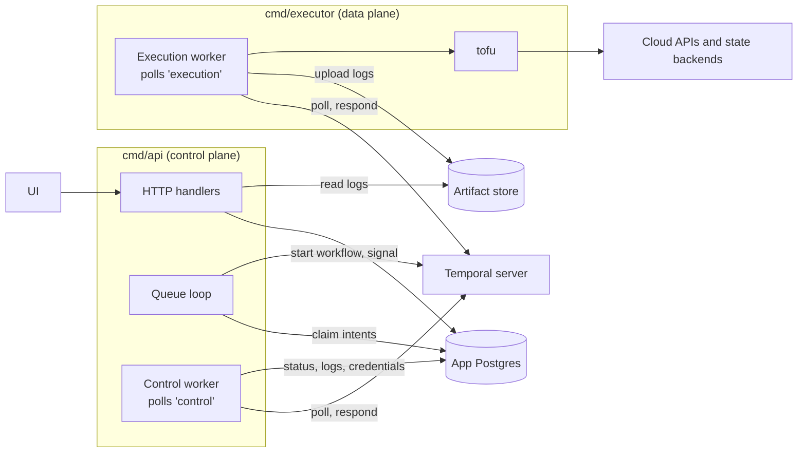
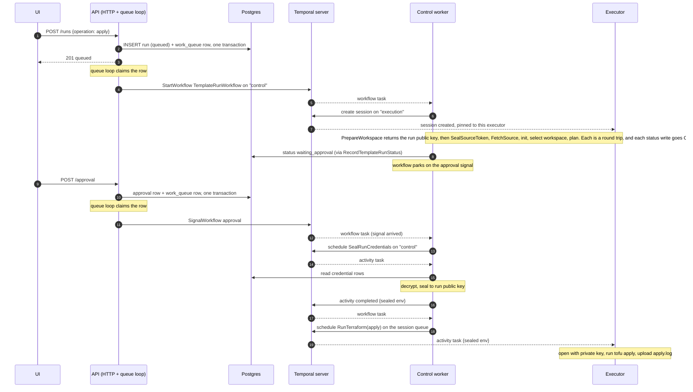
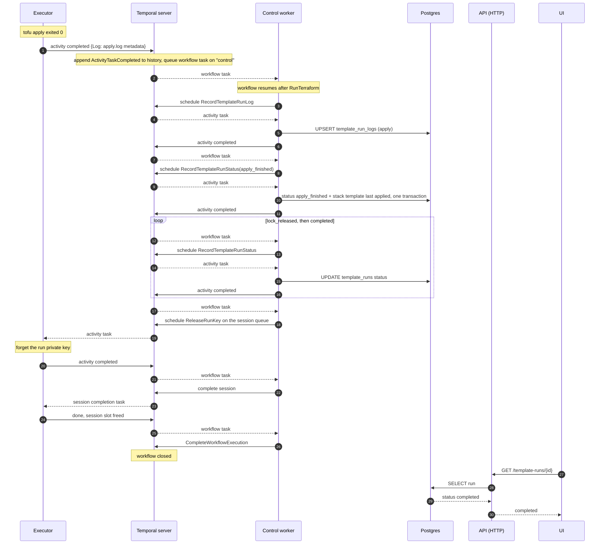
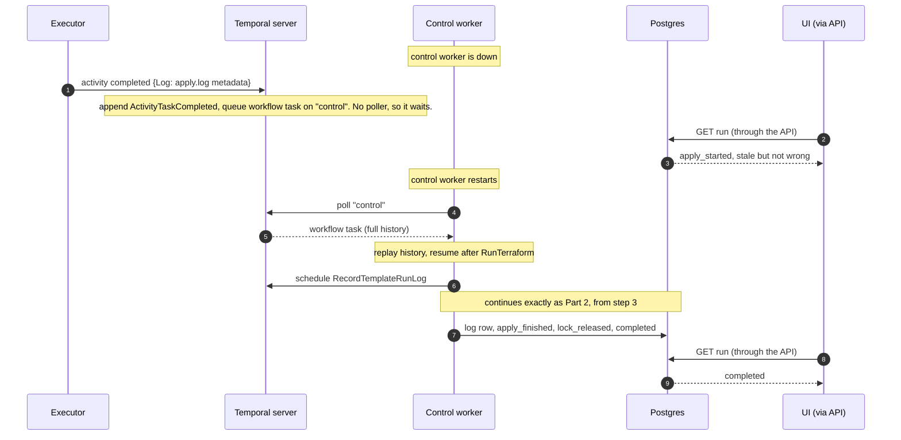

# Apply run sequence

How an apply run moves between the API, the control worker, Temporal, the
executor and Postgres, from the request until the run reads `completed`.
Background on why the processes are split this way is in
[the control plane split spec](superpowers/specs/2026-09-15-control-plane-split.md).

## Who connects to whom

Every arrow points from the process that opens the connection. Temporal never
opens a connection to anything.

The executor has no arrow to Postgres or to the API. Everything it needs arrives
through Temporal, and everything it produces goes back the same way.

## Reading the diagrams

- **Nothing calls the executor or the control worker.** Both keep a poll open
  against Temporal. A dashed arrow from Temporal is the server answering that
  poll, not a push.
- **Workflow code never touches Postgres.** It schedules an activity on the
  `control` queue; the control worker runs that activity and writes the row.
- **The API and the control worker are one process** (`cmd/api`). They are
  drawn apart because they play different roles: HTTP and the queue loop on one
  side, polling `control` on the other.
- **Every step is a round trip.** The workflow replies to a workflow task with a
  command ("schedule this activity"), Temporal hands that activity to a poller,
  the poller reports the result, and Temporal queues the next workflow task.

## Part 1: from the apply request to tofu running

Credentials cross Temporal only as ciphertext sealed to a key the executor
generated in `PrepareWorkspace`. They are sealed again before every Terraform
command, because an apply can start up to a day after its plan.

## Part 2: after `RunTerraform(apply)` succeeds

The executor's part ends at step 1, apart from releasing its key and closing
the session. Every write after that is a workflow step on the control worker,
which is what keeps them ordered: the log row cannot land after `completed`, and
a cancel that arrives during the apply cannot be overwritten by a late
`apply_finished`. Writing `apply_finished` also records the stack template's
last applied revision in the same transaction
(`recordsStackTemplateLastApplied`, `internal/postgres/repositories.go`).

## When the control worker is down

The executor does not depend on the control worker to finish an apply. If no
control worker is polling when step 1 happens, the result waits in Temporal's
history and Postgres still says `apply_started`. Nothing is lost: the workflow
resumes at step 2 as soon as a control worker polls again. The UI lags reality
for that long, because it only ever reads Postgres.

The executor finished at step 1, which is why the worker that picks the run
back up needs nothing from it except the log metadata already in history. The
session stays open on that executor until the session completes (steps 22 to 24
of Part 2).

## Where this lives in code

| Step | Code |
|---|---|
| Queue loop, control worker wiring | `cmd/api/main.go` (`startControlPlane`, `registerControl`) |
| Workflow | `internal/workflows/template_run.go` |
| Control activities | `internal/activities/control.go` |
| Execution activities | `internal/activities/template_run.go` |
| Executor wiring | `cmd/executor/main.go` |
| Sealing | `internal/runseal` |
| Queue names | `domain.ControlTaskQueue`, `domain.ExecutionTaskQueue` |
